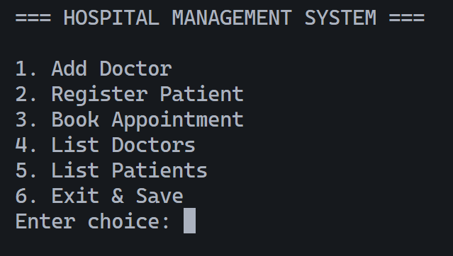
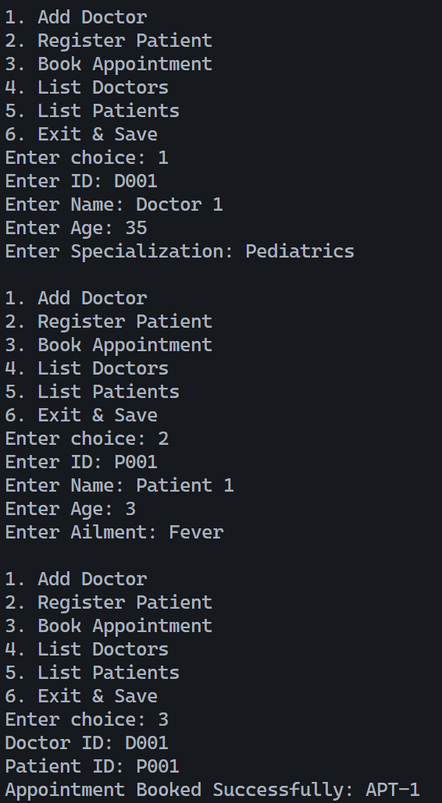

# Mannan Arora
# 24BAS10066

# Hospital Management System (HMS)

A console-based application to digitize hospital operations, replacing paper records with a secure, efficient digital system.

## Project Overview
The **Hospital Management System (HMS)** is designed to streamline the fundamental operations of a hospital clinic. It facilitates the management of doctors, registration of patients, and scheduling of appointments. The system ensures data persistence, meaning all records are saved locally and retrieved upon restart.

## Features
* **Doctor Management:** Maintain a directory of doctors with their IDs, names, and specializations.
* **Patient Registration:** Register new patients with unique IDs, personal details, and current ailments.
* **Appointment Scheduling:** Link registered patients to doctors to create appointment records.
* **Data Persistence:** Automatically saves data to binary files (`doctors.dat`, `patients.dat`) on exit.
* **Error Handling:** Custom exception handling for invalid IDs and booking conflicts.

## Technologies Used

| Category | Technology | Description |
| :--- | :--- | :--- |
| **Language** | Java | JDK 8+ (Core Java) |
| **Concepts** | OOP | Inheritance, Polymorphism, Abstraction |
| **Storage** | Java I/O | `Serializable` for binary file storage |
| **Version Control** | Git | Source code management |

## Steps to Install & Run

### Prerequisites
* **Java Development Kit (JDK)** installed on your machine.
* A terminal or command prompt.

### Installation
1.  **Clone the repository**

2.  **Navigate to the source directory:**
    ```bash
    cd HospitalManagementSystem/src
    ```

### Running the Application
To run the application, you must compile all packages from the source root.

1.  **Compile the Code:**
    ```bash
    javac com/hms/exception/*.java com/hms/model/*.java com/hms/util/*.java com/hms/service/*.java com/hms/main/*.java
    ```

2.  **Run the Main Class:**
    ```bash
    java com.hms.main.Main
    ```

## Instructions for Testing
The project includes a custom automated test runner (`TestRunner.java`) to verify functionality without external libraries.

1.  **Compile the Test Suite:**
    (Ensure you are in the `src` folder)
    ```bash
    javac com/hms/exception/*.java com/hms/model/*.java com/hms/util/*.java com/hms/service/*.java com/hms/main/*.java com/hms/test/*.java
    ```

2.  **Execute the Tests:**
    ```bash
    java com.hms.test.TestRunner
    ```

**Expected Output:**
> Test 1: Add Doctor... PASSED
> Test 2: Register Patient... PASSED
> ...

## Screenshots

### 1. Main Menu Interface

*The central hub for navigating the system options.*

### 2. Booking an Appointment


*Demonstration of successful appointment scheduling with validation.*
